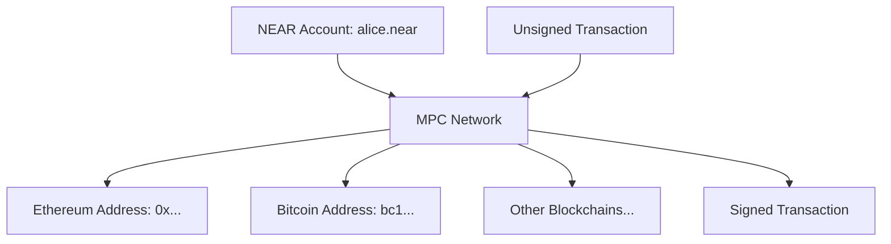

# omni-transactions-sdk

A TypeScript SDK for NEAR Chain Signatures, enabling multi-blockchain transaction signing through NEAR's MPC (Multi-Party Computation) network.

## Overview

NEAR Chain Signatures allows any NEAR account to sign transactions for multiple blockchains (Ethereum, Bitcoin, etc.) using a single NEAR account. The MPC network collectively holds secret keys and can sign transactions on behalf of users without exposing private keys.

This SDK provides:
- ✅ **Universal key derivation** - Generate addresses for multiple blockchains from a NEAR account
- ✅ **Testing utilities** - Local secret key implementation for development and testing
- 🚧 **MPC integration** - Submit transactions to NEAR's MPC network for signing *(coming soon)*
- 🚧 **Library adapters** - Work with popular libraries like viem, web3.js *(coming soon)*

## Quick Start

### Installation

```bash
bun install omni-transactions-sdk
# or
npm install omni-transactions-sdk
```

### Basic Usage

```typescript
import { OmniKey } from 'omni-transactions-sdk'

// Production: Create from NEAR public key (from MPC network)
const key = OmniKey.fromNEAR(
  "secp256k1:3tFRbMqmoa6AAALMrEFAYCEoHcqKxeW38YptwowBVBtXK1vo36HDbUWuR6EZmoK4JcH6HDkNMGGqP1ouV7VZUWya"
)

// Generate addresses for different blockchains
console.log("Ethereum:", key.ethereum)  // 0xa01ad27e7cb6f66bf8d7b188e9fb06afb8b01006
console.log("Bitcoin:", key.bitcoin)    // bc1q2u3gxafx3y9en9yur3467audg2n69r4rpfmjv2
console.log("NEAR:", key.near)          // secp256k1:3tFRbMqmoa6...

// Derive child keys for specific purposes
const ethKey = key.derive("alice.near", "ethereum-1")
const btcKey = key.derive("alice.near", "bitcoin-1")

console.log("Ethereum child:", ethKey.ethereum)  // 0xa2869d3977dea9afc9b9c069491ac08f06f9e458
console.log("Bitcoin child:", btcKey.bitcoin)    // bc1q96j504ke29e7ttnh0wkhnhr5qpj8alexu6h0gc
```

### Testing with Secret Keys

```typescript
// Testing: Create with secret key for local development
const testKey = OmniKey.random()
// or
const testKey = OmniKey.fromSecretHex("0x1234...")

// Check if key can sign (has secret key)
console.log("Can sign:", testKey.canSign())  // true

// Derive child keys (both public and secret)
const childKey = testKey.derive("test.near", "test-path")
console.log("Child can sign:", childKey.canSign())  // true
console.log("Child Ethereum:", childKey.ethereum)
```

## Background: NEAR Chain Signatures

### What is Chain Signatures?

NEAR Chain Signatures is a groundbreaking technology that allows NEAR accounts to control addresses on any blockchain. Instead of managing separate private keys for each blockchain, users can:

1. **Single source of truth**: Use their NEAR account to control addresses on Ethereum, Bitcoin, etc.
2. **No key management**: Never handle private keys directly - the MPC network manages them collectively
3. **Cross-chain transactions**: Sign transactions for any blockchain using familiar NEAR wallet interfaces

### How it Works



1. **Account Setup**: A NEAR account requests a root public key from the MPC network
2. **Address Generation**: Derive blockchain-specific addresses using hierarchical key derivation
3. **Transaction Signing**: Submit transaction hash to MPC network, receive signature
4. **Cross-chain Execution**: Use signed transaction on target blockchain

## Mathematical Foundation

### NEAR MPC Additive Key Derivation

Unlike BIP32's multiplicative derivation, NEAR uses **additive derivation** which allows the MPC network to derive child keys without knowing the parent secret key.

#### Core Formulas

Given a parent key and derivation parameters:

1. **Derivation tweak**: 
   ```
   ε = SHA3-256("near-mpc-recovery v0.1.0 epsilon derivation:" + account + "," + path)
   ```

2. **Child secret key** (MPC network):
   ```
   child_secret = (ε + parent_secret) mod n
   ```

3. **Child public key** (anyone can compute):
   ```
   child_public = ε × G + parent_public
   ```

#### Cryptographic Consistency

The key insight is that these formulas are mathematically equivalent:

```
child_secret × G = (ε + parent_secret) × G 
                 = ε × G + parent_secret × G 
                 = ε × G + parent_public 
                 = child_public ✅
```

This ensures that:
- The MPC network can derive child secret keys
- Anyone can derive child public keys  
- Both methods produce corresponding key pairs
- No secret information is leaked during public key derivation

#### Example Calculation

```typescript
// Given:
const account = "alice.near"
const path = "ethereum-1" 
const parentSecret = 0x1234... // Only MPC network knows this

// Anyone can compute:
const derivationString = "near-mpc-recovery v0.1.0 epsilon derivation:alice.near,ethereum-1"
const ε = SHA3-256(derivationString)
const childPublic = ε × G + parentPublic

// Only MPC network can compute:
const childSecret = (ε + parentSecret) mod n

// Mathematical guarantee:
childSecret × G === childPublic ✅
```

### Security Properties

1. **Verifiable**: Anyone can verify that a child public key was correctly derived
2. **Non-linkable**: Child keys don't reveal information about parent or sibling keys
3. **Deterministic**: Same inputs always produce same outputs
4. **Quantum-resistant derivation**: Uses SHA3-256 instead of HMAC-SHA512

## API Reference

### OmniKey Class

The unified class for handling both production (public-key-only) and testing (with-secret-key) scenarios.

#### Static Constructors

**Production (Public Key Only):**
```typescript
// From NEAR protocol format
OmniKey.fromNEAR(nearPublicKey: string): OmniKey

// From raw public key point  
OmniKey.fromPoint(point: ProjPointType<bigint>): OmniKey

// From uncompressed bytes (64 bytes)
OmniKey.fromBytes(bytes: Uint8Array): OmniKey
```

**Testing (With Secret Key):**
```typescript
// Generate random key pair
OmniKey.random(): OmniKey

// From secret key scalar
OmniKey.fromSecretKey(scalar: bigint): OmniKey

// From 32-byte secret key
OmniKey.fromSecretBytes(bytes: Uint8Array): OmniKey

// From hex string (with or without 0x)
OmniKey.fromSecretHex(hex: string): OmniKey
```

#### Instance Methods

**Key Derivation:**
```typescript
// Derive child key using NEAR MPC scheme
derive(predecessorId: string, path: string): OmniKey
```

**Address Generation:**
```typescript
get ethereum(): string      // 0x... (Keccak-256 of public key)
get bitcoin(): string       // bc1... (Bech32 format, modern)
get bitcoinP2PKH(): string  // 1... (P2PKH format, legacy)  
get bitcoinBech32(): string // bc1... (P2WPKH format, modern)
get near(): string          // secp256k1:... (NEAR protocol format)
```

**Public Key Access:**
```typescript
get rawPoint(): ProjPointType<bigint>  // Raw secp256k1 point
get bytes(): Uint8Array                // Uncompressed (65 bytes)
get compressed(): Uint8Array           // Compressed (33 bytes)
get hex(): string                      // Hex representation
```

**Secret Key Access (Testing Only):**
```typescript
canSign(): boolean           // Check if secret key available
get secretKey(): bigint      // Raw secret scalar (throws if none)
get secretBytes(): Uint8Array // 32-byte secret key
get secretHex(): string      // Hex representation
```

**Utilities:**
```typescript
equals(other: OmniKey): boolean  // Compare public keys
toString(): string               // Debug representation
```

## Examples

### Multi-Chain Wallet

```typescript
import { OmniKey } from 'omni-transactions-sdk'

class MultiChainWallet {
  constructor(private nearPublicKey: string) {}
  
  // Generate addresses for a specific purpose
  getAddresses(purpose: string) {
    const key = OmniKey.fromNEAR(this.nearPublicKey)
    const derived = key.derive("wallet.near", purpose)
    
    return {
      ethereum: derived.ethereum,
      bitcoin: derived.bitcoin,
      near: derived.near
    }
  }
  
  // Get trading addresses
  getTradingAddresses() {
    return this.getAddresses("trading")
  }
  
  // Get savings addresses  
  getSavingsAddresses() {
    return this.getAddresses("savings")
  }
}

const wallet = new MultiChainWallet("secp256k1:3tFRbMqmoa6...")
console.log(wallet.getTradingAddresses())
// {
//   ethereum: "0xa2869d3977dea9afc9b9c069491ac08f06f9e458",
//   bitcoin: "bc1q96j504ke29e7ttnh0wkhnhr5qpj8alexu6h0gc", 
//   near: "secp256k1:2Bg4..."
// }
```

### Testing Framework Integration

```typescript
import { OmniKey } from 'omni-transactions-sdk'
import { describe, test, expect } from 'vitest'

describe('Cross-chain integration', () => {
  test('should derive consistent addresses', () => {
    // Use deterministic test key
    const testKey = OmniKey.fromSecretHex("0x1234567890abcdef...")
    
    const ethKey = testKey.derive("test.near", "ethereum-test")
    const btcKey = testKey.derive("test.near", "bitcoin-test")
    
    // Verify addresses are deterministic
    expect(ethKey.ethereum).toBe("0x...")
    expect(btcKey.bitcoin).toBe("bc1...")
    
    // Verify cryptographic consistency
    const recomputedEth = OmniKey.fromSecretKey(ethKey.secretKey)
    expect(ethKey.equals(recomputedEth)).toBe(true)
  })
})
```

### Bridge Application

```typescript
import { OmniKey } from 'omni-transactions-sdk'

class CrossChainBridge {
  constructor(private nearAccount: string, private rootKey: string) {}
  
  // Generate deposit addresses for users
  generateDepositAddress(userId: string, sourceChain: string) {
    const key = OmniKey.fromNEAR(this.rootKey)
    const userKey = key.derive(this.nearAccount, `bridge/${userId}/${sourceChain}`)
    
    switch (sourceChain) {
      case 'ethereum':
        return userKey.ethereum
      case 'bitcoin':
        return userKey.bitcoin
      default:
        throw new Error(`Unsupported chain: ${sourceChain}`)
    }
  }
  
  // Verify a deposit came from the correct address
  verifyDepositAddress(userId: string, sourceChain: string, address: string) {
    const expectedAddress = this.generateDepositAddress(userId, sourceChain)
    return address === expectedAddress
  }
}

const bridge = new CrossChainBridge("bridge.near", "secp256k1:...")
const depositAddr = bridge.generateDepositAddress("alice", "ethereum")
console.log(`Send ETH to: ${depositAddr}`)
```

## Development

### Setup

```bash
bun install
```

### Running Tests

```bash
bun test          # Run all tests
bun run typecheck # TypeScript type checking
bun run lint      # Code linting and formatting
```

### Building

```bash
bun run build     # Compile TypeScript
```

## Roadmap

- ✅ **Phase 1.1**: Universal key derivation and address generation
- 🚧 **Phase 1.2**: NEAR MPC integration for transaction signing
- 🚧 **Phase 1.3**: Viem adapter for Ethereum transactions
- 🚧 **Phase 1.4**: Testing infrastructure and mock MPC signer
- 🚧 **Phase 2**: Bitcoin transaction support
- 🚧 **Phase 3**: Additional chains (Solana) and wallet integrations

See [ROADMAP.md](./ROADMAP.md) for detailed development plans.

## Security

This SDK uses audited cryptographic libraries:
- **[@noble/curves](https://github.com/paulmillr/noble-curves)** - Elliptic curve cryptography
- **[@noble/hashes](https://github.com/paulmillr/noble-hashes)** - Cryptographic hash functions
- **[@scure/btc-signer](https://github.com/paulmillr/scure-btc-signer)** - Bitcoin address generation

⚠️ **Important**: The `OmniSecretKey` functionality is for testing only. In production, secret keys are managed by NEAR's MPC network and never exposed.

## Contributing

1. Fork the repository
2. Create a feature branch
3. Make your changes with tests
4. Run `bun test` and `bun run lint`
5. Submit a pull request

## License

MIT License - see [LICENSE](./LICENSE) for details.

## Links

- [NEAR Chain Signatures Documentation](https://docs.near.org/tools/chain-signatures)
- [NEAR MPC Recovery Specification](https://github.com/near/mpc-recovery)
- [@noble/curves Documentation](https://github.com/paulmillr/noble-curves)